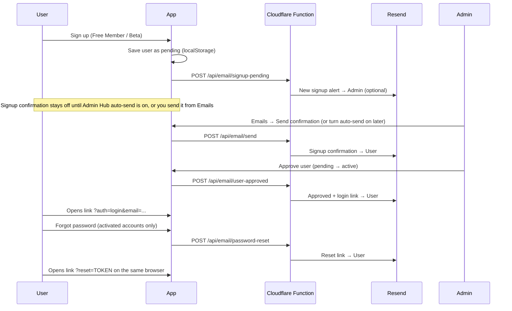

# Resend email setup — My Plan, Not My Mood

Transactional emails for **admin signup alerts**, **signup confirmation** (manual until you turn auto-send on), **user activation (login link)**, and **password reset**.

New testers do **not** get a confirmation email automatically. Manage templates, send tests, and trigger confirmation from **Admin Hub → Emails**.

From address: `My Plan, Not My Mood <info@nonnegotiation.com>`.

---

---

## 1. Create your Resend account

1. Go to [https://resend.com/signup](https://resend.com/signup)
2. Verify your email and sign in to the dashboard

---

## 2. Add and verify your sending domain

1. In Resend → **Domains** → **Add Domain**
2. Enter `nonnegotiation.com` (or your production domain)
3. Add the DNS records Resend shows (SPF, DKIM) at your domain registrar
4. Wait until status is **Verified**

Until the domain is verified you can test with Resend’s sandbox sender:
`onboarding@resend.dev` (only delivers to the email on your Resend account). Production from address is `info@nonnegotiation.com`.

---

## 3. Create an API key

1. Resend → **API Keys** → **Create API Key**
2. Name it e.g. `my-plan-not-my-mood-production`
3. Copy the key (`re_...`) — you will not see it again

---

## 4. Add secrets to Cloudflare Pages

Cloudflare Pages project: **my-plan-not-my-mood**  
Custom domain: **https://nonnegotiation.com**

Do **not** add secrets on the older Pages project named `nonnegotiation` (that one only has `nonnegotiation.pages.dev` and does not serve the live site).

| Variable | Example | Purpose |
|----------|---------|---------|
| `RESEND_API_KEY` | `re_xxxxxxxx` | Resend API key |
| `FROM_EMAIL` | `My Plan, Not My Mood <info@nonnegotiation.com>` | Verified sender |
| `APP_URL` | `https://nonnegotiation.com` | Login links in emails |
| `ADMIN_NOTIFY_EMAIL` | `evelyn3@cox.net` | Optional: alert on new signup |

**Cloudflare dashboard:** Pages → your project → **Settings** → **Environment variables** → add for **Production** (and Preview if desired).

---

## 5. Deploy with Functions

This repo includes Cloudflare Pages Functions:

| Endpoint | When it runs |
|----------|----------------|
| `POST /api/email/signup-pending` | After Free Member / Beta signup — **admin alert only** (no email to the tester yet) |
| `POST /api/email/send` | Admin Hub test send, or manual signup confirmation |
| `POST /api/email/user-approved` | When admin sets user **pending → active** |
| `POST /api/email/password-reset` | When an activated account requests a lost-password link |

Deploy as usual:

```powershell
Set-Location "C:\Users\evely\Documents\antigravity\eager-hypatia\my-plan-not-my-mood"
bun run deploy
```

Wrangler uploads the `functions/` folder with the static `dist/` build.

---

## 6. Local development

**Default (`bun run dev` on port 3001):** `/api` proxies to production. Test sends and confirmations work on localhost as long as Cloudflare has `RESEND_API_KEY` set.

**Fully local API + Resend** (optional):

1. Copy `.dev.vars.example` → `.dev.vars` and add your `RESEND_API_KEY`.
2. Terminal 1: `bun run build && bun run dev:api` (Wrangler on port 8788).
3. Terminal 2:

```powershell
$env:VITE_API_PROXY='http://127.0.0.1:8788'
bun run dev
```

If Resend is not configured, the API returns 503 and the UI shows a skip notice — signup still works.

---

## 7. Email flow



---

## 8. Test checklist

- [ ] Sign up as new member → **no** confirmation email unless Admin Hub auto-send is on; admin alert if `ADMIN_NOTIFY_EMAIL` is set
- [ ] Admin Hub → Emails: edit templates, send a **[TEST]** email, or send confirmation to one user
- [ ] Approve user in Admin → Users → approval email with **Sign In Now** link
- [ ] Login link opens site with sign-in modal and email prefilled
- [ ] Pending users cannot sign in until activated
- [ ] Forgot password for an activated account sends a reset link (`?reset=`)
- [ ] Pending / unknown emails get the same generic notice and no mail
- [ ] Run `bun run test` — email template + notification tests pass

---

## 9. Future (server-side user DB)

Today users live in **browser localStorage**, so emails are the cross-device notification layer. For production multi-device auth, migrate users to **Cloudflare D1** or **Supabase** and replace magic login links with one-time tokens.

See `docs/requirements-and-tech-stack.md` for planned stack.
