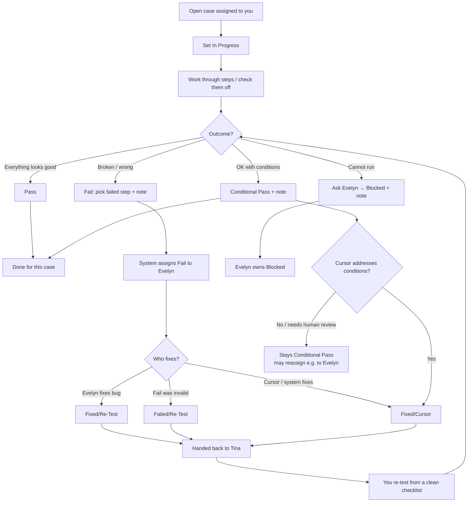
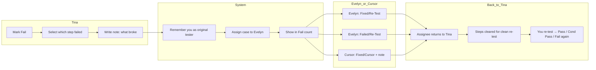
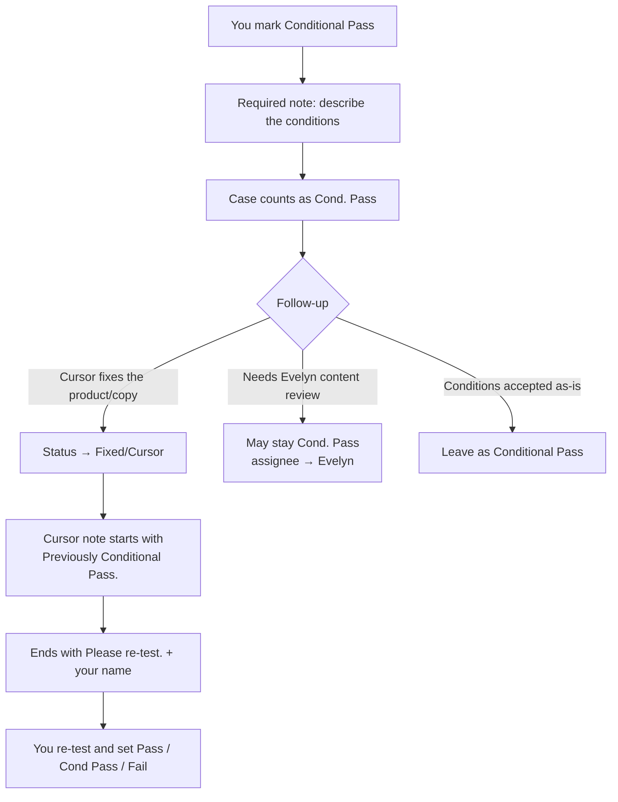

# GYSH Testing Process — Guide for Tina

This guide explains how you run tests in the **Testing Portal**, what each status means, and what happens after Fail, Conditional Pass, and system (Cursor) fixes.

**Where to work:** Admin → Testing Portal (and Schedule / Implementation Board for sprint work).

---

## Quick start (your daily path)

1. Open **Testing Portal**.
2. Filter by **Tina** (your chip) so you only see your cases.
3. Prefer the **current sprint** filter (or open cases due soon).
4. Open a case → follow the steps → check them off as you go.
5. Set a final status (Pass / Conditional Pass / Fail) and add a note when required.
6. Watch for **Fixed/Cursor** and **Fixed/Re-Test** — those are ready for you to **re-test**.

---

## Status definitions

| Status | What it means | Who sets it | Note required? | Counts as “done”? |
|--------|----------------|-------------|----------------|-------------------|
| **Not Started** | Not begun yet | Default / anyone with QA access | No | No |
| **In Progress** | You started working it | You | No | No |
| **Pass** | Product matches expectations; all steps OK | You | No | Yes |
| **Conditional Pass** | Acceptable *with conditions* (copy tweak, follow-up, “Evelyn should review,” etc.) | You | **Yes** — describe the conditions | Yes (resolved, but still tracked as Cond. Pass) |
| **Fail** | Real product bug or broken behavior | You | **Yes** — what failed; select failing step | Yes (resolved as a failure) |
| **Blocked** | Cannot run (environment, missing data, dependency) | **Evelyn only** | **Yes** | Yes |
| **Fixed/Re-Test** | Evelyn fixed a real bug; back to you to verify | **Evelyn only** | **Yes** (what was fixed) | No — open until you re-test |
| **Failed/Re-Test** | Fail was invalid (misunderstood / unclear test); back to you to clarify or re-run | **Evelyn only** | **Yes** (why not a real fail) | No — open until you re-test |
| **Fixed/Cursor** | Cursor (system) fixed the issue; back to you to verify | Evelyn or Cursor process | **Yes** (what Cursor fixed + **Please re-test.**) | No — open until you re-test |

**Important:** Anything the **system (Cursor)** fixes — whether it started as a **Fail** or a **Conditional Pass** — is moved to **Fixed/Cursor**. Those cases appear in the **Fixed/Cursor** count (purple segment on the progress bars), not in Fail or Conditional Pass anymore.

---

## Flowchart — Tina’s main testing path



---

## Flowchart — Fail path (detail)



---

## Flowchart — Conditional Pass path (detail)



---

## What you must do for each outcome

### Pass
- Check **all** steps (or the portal will complete them when you click Pass).
- No note required.
- Case is finished unless someone reopens it later.

### Conditional Pass
- **Always write a note** (at least a short sentence) describing the conditions.
  - Examples: “Footer CTAs go to the same page — should differentiate.” / “Should be reviewed by Evelyn.”
- You do **not** need every step checked (unlike Pass).
- This is still a resolved outcome, but it signals follow-up work.

### Fail
- Select **which step failed**.
- **Always write a note** describing the failure.
- Optional: attach a screenshot/PDF (keep under ~1.5MB).
- The system:
  - Saves you as the **original tester**
  - Assigns the case to **Evelyn** for triage
  - Counts it under **Fail**

### Blocked
- Only Evelyn can set this.
- If you are stuck, leave a note / message Evelyn so she can Block it with a reason.

---

## Fixed/Cursor — system fixes (how notes work)

When **Cursor** (or the Cursor process) fixes something for you:

1. Status becomes **Fixed/Cursor** (purple on progress bars).
2. The case is **handed back to you** (Tina).
3. Step checkboxes are **cleared** so you re-test cleanly.
4. A **Cursor** note is **appended** (older notes are kept — nothing should be deleted).

### Cursor note format

**If it was a Fail:**

```text
Previously Failed. <what was fixed>. Please re-test. Tina
```

**If it was a Conditional Pass:**

```text
Previously Conditional Pass. <what was fixed>. Please re-test. Tina
```

Your **original QA note stays** in the note thread (author: Tina). The Cursor note is a new entry below it.

### Your job when you see Fixed/Cursor
1. Read Tina’s original note + the Cursor note.
2. Re-run the case on the live site.
3. Set **Pass**, **Conditional Pass** (with a new note if still conditional), or **Fail** again.

---

## Fixed/Re-Test vs Failed/Re-Test vs Fixed/Cursor

| Status | Meaning | After you re-test… |
|--------|---------|---------------------|
| **Fixed/Re-Test** | Evelyn fixed a real bug | Pass if fixed; Fail again if not |
| **Failed/Re-Test** | Your Fail was not a product bug (unclear/misunderstood test) | Clarify, then Pass / adjust / Fail with a clearer note |
| **Fixed/Cursor** | System/Cursor fixed Fail **or** Conditional Pass follow-up | Same as Fixed/Re-Test — verify, then set final status |

All three stay **open** until you re-test. They are **not** counted as Pass.

---

## How progress counts work (Tina chip)

On Testing Portal, your bar shows roughly:

- **Pass** — green  
- **Conditional Pass** — teal  
- **Fail** — red  
- **Blocked** — amber  
- **Fixed/Re-Test** — blue  
- **Failed/Re-Test** — orange  
- **Fixed/Cursor** — purple ← **all system fixes land here**  
- **In Progress** / **Not Started** — still open work  

Example: if Cursor clears 7 Conditional Pass items and 9 Fails, those 16 leave Cond. Pass / Fail and move into **Fixed/Cursor** until you re-test them.

The chip text **“X/Y passed”** uses **Pass only** in the numerator (Conditional Pass is separate on the bar).

---

## Notes rules (please follow)

| Situation | Note? |
|-----------|--------|
| Pass | Optional |
| Conditional Pass | **Required** — conditions |
| Fail | **Required** — what broke + which step |
| Blocked | **Required** (Evelyn) |
| Fixed/Cursor, Fixed/Re-Test, Failed/Re-Test | **Required** (writer of that status) |

- Prefer short, clear sentences.
- **Do not delete** older notes. Add a new note entry if you need to update.
- Attach evidence when it helps (Fail / Conditional Pass).

---

## Sprint Board vs Testing Portal

- **Testing Portal** = run tests, set statuses, notes, evidence.  
- **Implementation / Sprint Board** = same tests as cards on a sprint; use it to see sprint load.  
- Prefer the **current sprint** when you open the board.
- Counts can differ slightly if the board mixes **tasks + tests** or a different sprint filter — when in doubt, trust **Testing Portal → Tina chip** for your test progress.

---

## Checklist for Tina

- [ ] Filter Testing Portal to **Tina**
- [ ] Work current-sprint / due items first  
- [ ] **Pass** only when truly good  
- [ ] **Conditional Pass** only with a clear conditions note  
- [ ] **Fail** with failed step + note (goes to Evelyn)  
- [ ] When status is **Fixed/Cursor** or **Fixed/Re-Test** → **re-test**, then set Pass / Cond Pass / Fail  
- [ ] Never remove prior notes — only add  

---

*Questions about Blocked, Fixed/Re-Test, or ownership → Evelyn (Lead Developer).*
